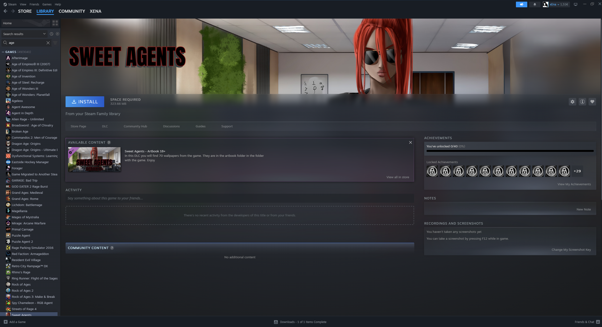

#  LAN Games Deployer

A lightweight Windows desktop app that lets each PC:
- choose a local `Game Folder` to share,
- auto-discover other PCs on the same LAN,
- list local and remote games in one UI,
- chat with other PCs on the LAN,
- see what other players are currently playing,
- search, filter, and sort games,
- preview local cover/banner images from game folders,
- launch local game executables directly,
- set per-game launch executable from right-click menu,
- persist selected shared folder and EXE overrides in `%APPDATA%`,
- share game launch EXE preference metadata over LAN,
- open local game folders, and
- download a remote game folder directly (files/folders, no ZIP).

## Version 1.0

This release focuses on LAN game sharing, direct file transfer, Steam-style presentation, and a lightweight Windows-friendly footprint.

## How It Works
- LAN discovery: UDP broadcast on port `50055`.
- File serving: local HTTP server on port `50111`.
- Game detection: each subfolder in the selected root that contains at least one `.exe`.
- Launch EXE selection: prefers `.exe` matching folder name; otherwise picks the largest `.exe`.
- Override launch EXE: right-click a local game -> `Set Launch Executable...`.
- Cover image search order: `cover.*`, `banner.*`, `folder.*`, `boxart.*`, `art.*`, then first image in folder.
- Config storage: `%APPDATA%\LAN Games Deployer\config.json`.

## Run (dev)
1. Install Python 3.9+ on Windows.
2. From project root:

```powershell
python src\main.py
```

## Build a Windows EXE
Install PyInstaller:

```powershell
pip install pyinstaller
```

Build:

```powershell
pyinstaller --noconfirm --clean --onefile --windowed --name "LANGamesDeployer" --version-file version_info.txt src\main.py
```

Output executable:
- `dist\LANGamesDeployer.exe`

## Usage
1. Start app on each LAN PC.
2. `File -> Choose Shared Folder` and pick a root folder containing game subfolders.
3. Optional: right-click a local game in list -> `Set Launch Executable...`.
4. Use the left panel controls:
   - Search by game name/owner/path
   - Filter source (`All`, `Local`, `LAN`)
   - Sort (`Name`, `Owner`, `Source`)
5. Select a game to view details and use actions.

## Notes
- First run may trigger Windows Defender Firewall prompt or UAC for rule setup.
- This prototype assumes trusted LAN usage.
- Large folders may take time to transfer over LAN.
- Tkinter displays PNG/GIF reliably; some JPG files may not preview depending on runtime.

## Screenshots




