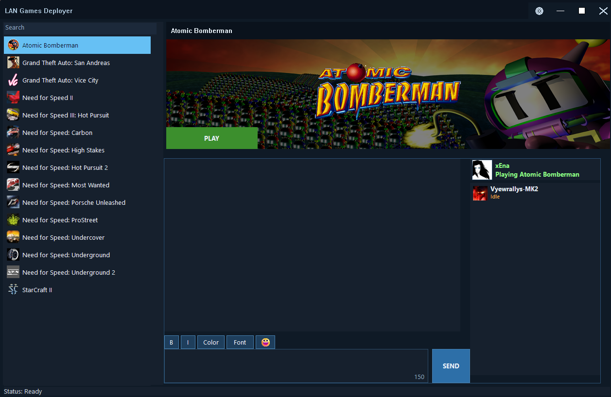
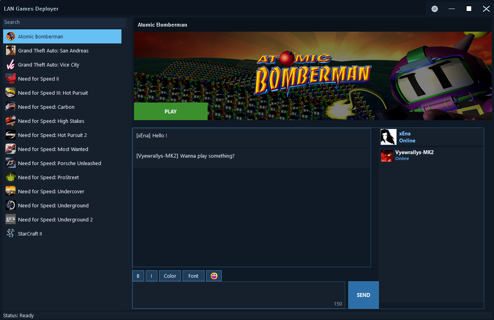

# LAN Games Deployer v1.2 Release Notes

**LAN Games Deployer** is a LAN game sharing and launcher app for Windows PCs.

## Highlights
- Discover shared game folders on the local network.
- Copy files and folders directly over LAN.
- Launch games from a selected executable.
- Show cover/banner art, icons, and logos when available.
- Use LAN chat and friend/status presence.
- See what other PCs on the LAN are playing.
- Keep settings local to the machine.

## Images

## Release assets
- Portable ZIP
- Windows installer

## Security note
Release packages should not contain hardcoded API keys. Use environment variables for secret tokens during local development and builds.
